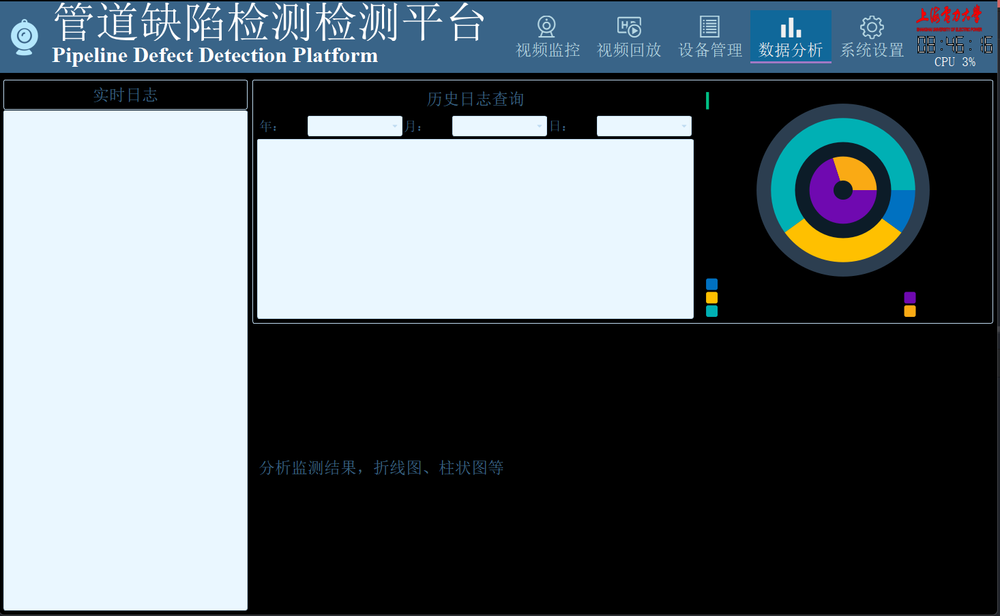

# VideoManagementPlatform

## 视频监控页面

- 视频播放组件
	- 最多64个视频流
	- 支持RTSP、RTMP、HTTP_FLV、本地摄像头
	- 支持截图、全屏

## 视频回放页面

- 视频回放组件
	- 监控时间线，异常监控时间段高亮
	- 视频流详情
	- 监控日期内的视频

## 设备管理页面

- 巡检机器人管理页面
	- 巡检地图以及机器人定位
	- 巡检进度条
	- 巡检历史统计
	- 关键点照片
	- 机器人基本信息

## 数据分析页面
- 数据分析页面	
	- 实时日志显示 
	- 历史日志查询
    - 日志信息统计
    - 报警信息统计

## 系统设置页面
- 系统设置页面
	- 常规设置
	- 服务器设置
	- 账户设置
	- 数据库设置
	- ......

